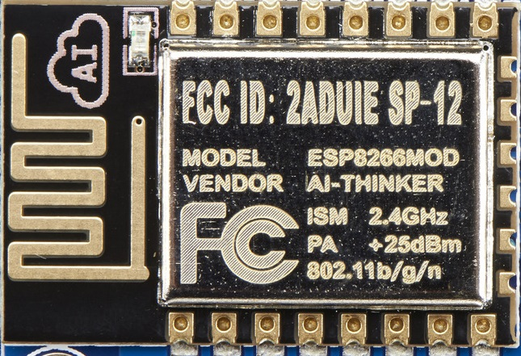
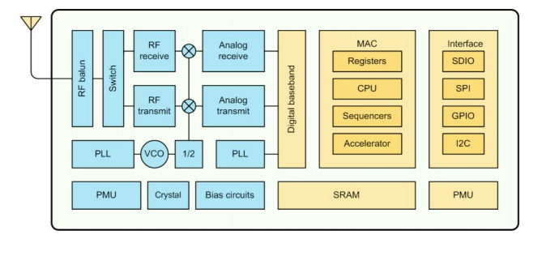
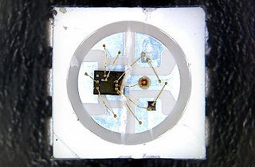

# NeoGram v0.1α 🎨

NeoGram is an ESP8266 based Open Source Hardware  Development board aimed to provide experiments on NeoPixels (WS2812B) using ESP8266. 

NeoGram is Powerd by [ESP8266-12E Module](Documents/ESP12E-Datasheet.pdf) which is encapsulates <b>Tensilica L106</b> integrates industry-leading ultra low power 32-bit MCU micro, with the 16-bit short mode,
Clock speed support 80 MHz, 160 MHz, supports the RTOS, integrated Wi-Fi MAC/BB/RF/PA/LNA, on-board antenna. The 12 of the  <b>WS2812B</b> can be progarmme indvidualy as maker wish to make there project colorfull 🌈.  

###  Features 

* 12 x Programmble WS2812B
* Plug and Play
* Inbuilt WiFi
* Inbuilt USB to UART
* Inbuild Voltage Regulator
* Reset button
* RED "ON" LED so you know its powered
* MicroUSB port for programming and debugging 
* USB port can act like serial port, keyboard, mouse, joystick or MIDI!
* Powerd by ESP8266-12E - 32 bit, running at 3.3v at 160 MHz
* Arduino Comptable 
* Micropython Compatble
* OpenSource Hardware ❤️

 

## Schematic 

  

The [NeoGram Schematics](Hardware) Divided into Four Sections.

* ESP8266 Main Module
* WS2812B LED Array
* Power Section
* USB to UART 

## ESP8266

  

The ESP8266 processor from Espressif is an 80 MHz microcontroller with a full WiFi front-end (both as client and access point) and TCP/IP stack with DNS support as well. While this chip has been very popular, its also been very difficult to use. Most of the low cost modules are not breadboard friendly, don't have an onboard 1000mA 3.3V regulator or level shifting.

The NeoGram comes with a onboard 1000mA 3.3v regulator with Arduino/MicroPython Support. 🎉

The module supports standard IEEE802.11 b/g/n agreement, complete TCP/IP protocol stack. Users can use the
add modules to an existing device networking, or building a separate network controller .

  

img src: Espressif

## WS2812b  

<b>NeoGram</b> comes with 12 programable WS2812B a.k.a NeoPixel leds. NeoPixel” is Adafruit’s brand for individually-addressable RGB color pixels and strips based on the WS2812, WS2811 and SK6812 LED/drivers, using a single-wire control protocol. 

  

Img src: Adafruit

[WS2812B](Documents/WS2812B.pdf) is a intelligent control LED light source that the control circuit and RGB chip are integrated in
a package of 5050 components. It internal include intelligent digital port data latch and signal reshaping ampli
fication drive circuit. Also include a precision internal oscillator and a 12V voltage programmable constant curr
e-nt control part, effectively ensuring the pixel point light color height consisten.

