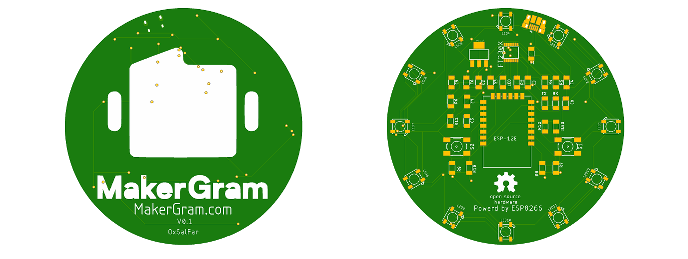
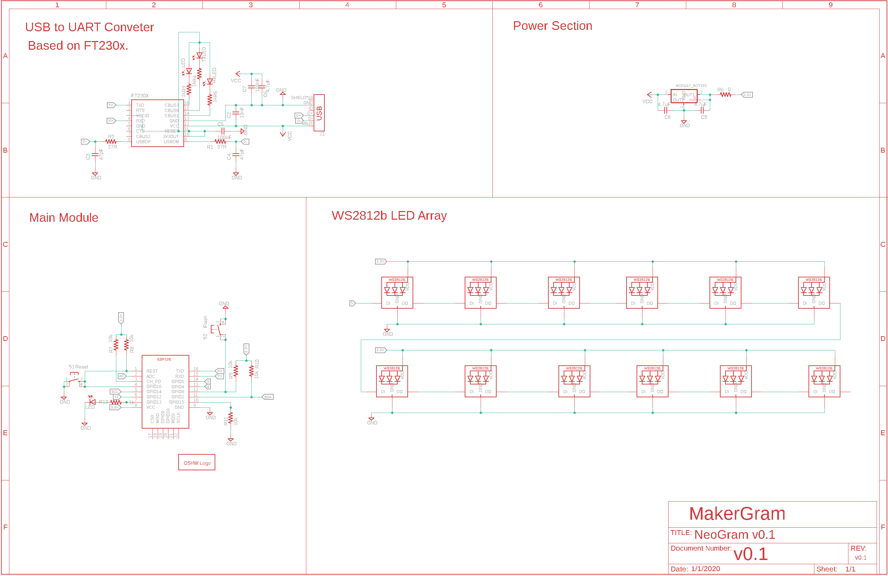
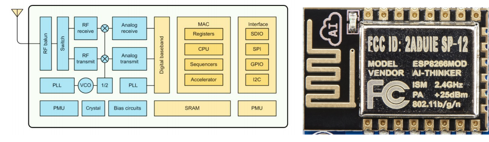
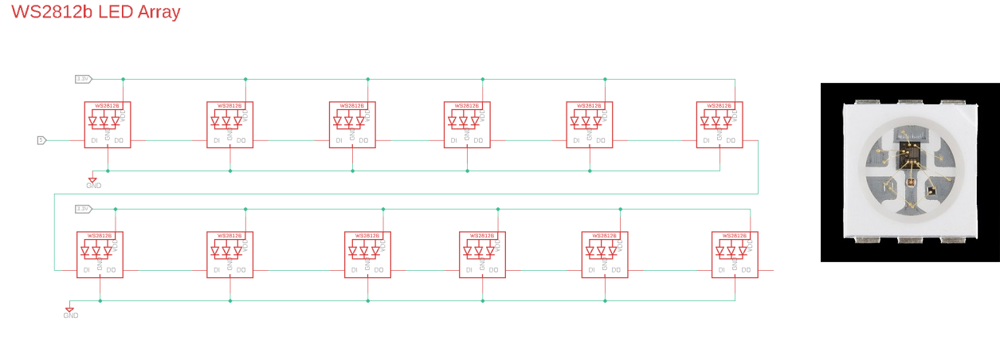
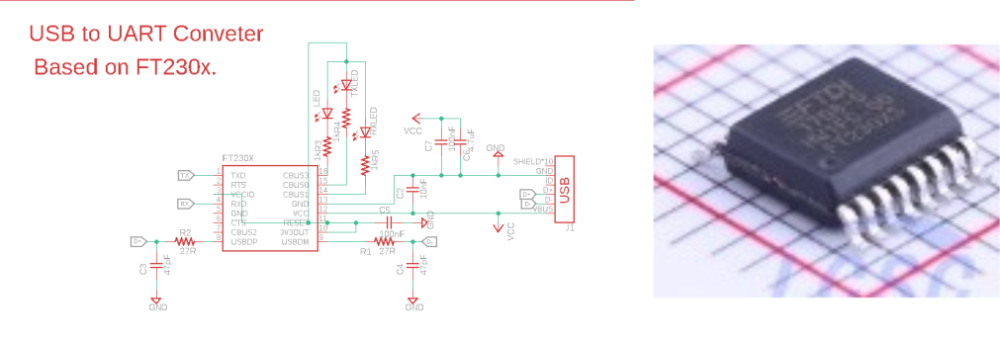
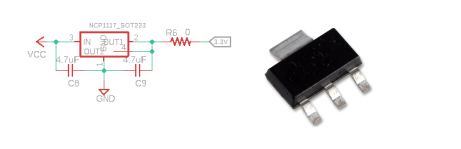
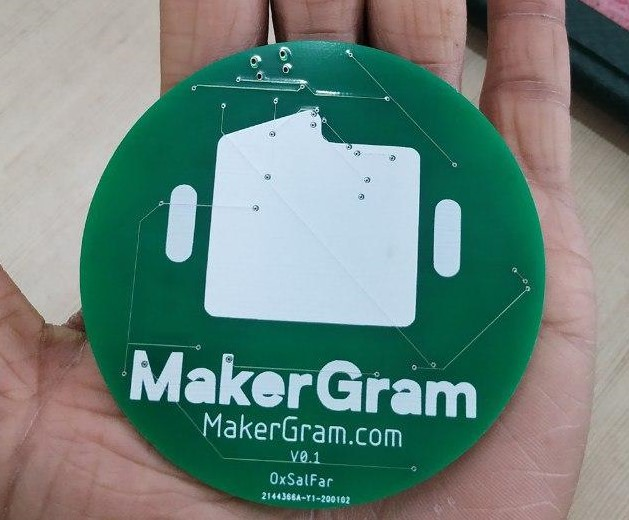

# NeoGram v0.1α 🎨

NeoGram is an ESP8266 based Open Source Hardware  Development board aimed to provide experiments on NeoPixels (WS2812B) using ESP8266. 

NeoGram is Powerd by [ESP8266-12E Module](Documents/ESP12E-Datasheet.pdf) which is encapsulates <b>Tensilica L106</b> integrates industry-leading ultra low power 32-bit MCU micro, with the 16-bit short mode,
Clock speed support 80 MHz, 160 MHz, supports the RTOS, integrated Wi-Fi MAC/BB/RF/PA/LNA, on-board antenna. The 12 of the  <b>WS2812B</b> can be progarmme indvidualy as maker wish to make there project colorfull 🌈.  

###  Features 

* 12 x Programmble WS2812B
* Plug and Play
* Inbuilt WiFi
* Inbuilt USB to UART
* Inbuild Voltage Regulator
* Reset button
* Power led
* MicroUSB port for programming and debugging 
* USB port can act like serial port, keyboard, mouse, joystick or MIDI!
* Powerd by ESP8266-12E - 32 bit, running 3.3v at 160 MHz
* Arduino Comptable 
* Micropython Compatble
* OpenSource Hardware ❤️

 

## Schematic 

  

The [NeoGram Schematic](Hardware) Divided into Four Sections.

* ESP8266 Main Module
* WS2812B LED Array
* USB to UART
* Power Section

## ESP8266

  

The ESP8266 processor from Espressif is an 80 MHz microcontroller with a full WiFi front-end (both as client and access point) and TCP/IP stack with DNS support as well. While this chip has been very popular, its also been very difficult to use. Most of the low cost modules are not breadboard friendly, don't have an onboard 1000mA 3.3V regulator or level shifting.

The NeoGram comes with a onboard 1000mA 3.3v regulator with Arduino/MicroPython Support. 🎉

The module supports standard IEEE802.11 b/g/n agreement, complete TCP/IP protocol stack. Users can use the
add modules to an existing device networking, or building a separate network controller , so It's very conpatable for Internet Of Things project. 

## WS2812b  

  

<b>NeoGram</b> comes with 12 programable WS2812B a.k.a NeoPixel leds. NeoPixel” is Adafruit’s brand for individually-addressable RGB color pixels and strips based on the WS2812, WS2811 and SK6812 LED/drivers, using a single-wire control protocol. 

[WS2812B](Documents/WS2812B.pdf) is a intelligent control LED light source that the control circuit and RGB chip are integrated in
a package of 5050 components. It internal include intelligent digital port data latch and signal reshaping ampli
fication drive circuit. Also include a precision internal oscillator and a 12V voltage programmable constant curr
e-nt control part, effectively ensuring the pixel point light color height consisten.

## USB to UART

  

NeoGram using [FT230x](Documents/ft230x.pdf). The FT230X is a USB to serial UART interface with optimised pin count for
smaller PCB designs. It act as a USB to asynchronous serial data
transfer interface and  No USB specific firmware programming required for the NeoGram. It's ahve Transmit and receive LED drive signals with dev board. 

The FTDI can act as an has an debug port so you can plug in an USB or console cable to upload software and read/write debugging information via the UART. When you're done with your coding, remove the cable, and this little module can be embeded into your project box.

## Power

  

NeoGram comes with onboard 1000mA 3.3V regulator, so we can directly connect USB power supply without any regulator or level shifting. The Power section based on the [LM1117](Documents/lm1117.pdf), it's a The LM117 and LM317-N series of adjustable 3-pin positive voltage regulators are capable of supplying in excess of 1.5 A over a 1.25-V to 37-V output range and a wide temperature range.  we also attached 0.1uf input and output filter capacitors.

  

## Resouce
* [Component Datasheets](Documents)
* [PCB Design Files](Hardware)
* [PCB Manufacturing File](Hardware/Manufacturing-File)

## Logs

* Jan 2020: Concept and Design
* Jan 2020: Completed PCB Design
* Feb 2020: Complted PCB Fabrication 

## To-Do

- [x] PCB Desiging.
- [x] PCB Fabrication.
- [ ] Source Components.
- [ ] Solder Components.
- [ ] Add Custom Board Definition. 

